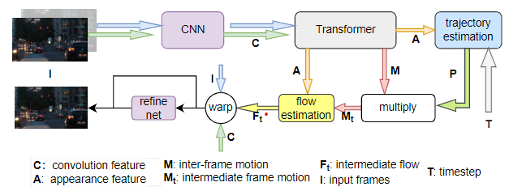
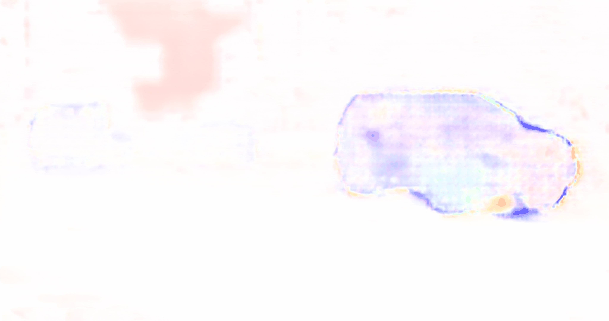

# Efficient Video Frame Interpolation by Appearance-based Intermediate Flow Estimation

<div align="center">
  
</div>

## :satisfied: HighLights

We discuss the shortcoming of local linear assumption for Intermediate flow estimation and propose to generate intermediate motion feature based on appearance feature for flow estimation. Meanwhile, we improve the inter-frame attention by a cyclic window shifting which makes sure that each area directly comunicates with its full neighborhood in the adjecent frame.

## :two_hearts:Dependencies
We provide our environment configuration as a reference:
- python == 3.8.17
- opencv-python == 4.8.0.76
- numpy == 1.24.4
- Pillow == 10.0.1
- torch == 1.12.0+cu102
- scikit-image == 0.21.0
- tqdm == 4.66.1
- torchvision == 0.13.0+cu102
- timm == 0.9.11

## :sunglasses:	Play with Demos

1. Download the [model checkpoints](https://pan.baidu.com/s/1OfYew5tnO6_1bIi7tXe3Og)(&code:gi5j) and put the ```ckpt``` folder into the root dir.
2. Put two images as 'example/img1.jpg' and 'example/img2.jpg'.
3. Run the following commands to generate 2x and Nx (arbitrary) frame interpolation demos:
```shell
python demo_2x.py --number 298       # for 2x interpolation
python demo_Nx.py --number 298 --n 8  # for 8x interpolation
```

### Some results on X4K1000FPS

<div style="display: flex; flex-wrap: wrap; justify-content: space-between;">

  <!-- 第一行 -->
  <div style="flex: 0 0 30%; margin-bottom: 10px;">
     
  </div>  


  <!-- 第二行 -->
  <div style="flex: 0 0 30%; margin-bottom: 10px;">
    

  </div><div style="flex: 0 0 30%; margin-bottom: 10px;">
    

  </div><div style="flex: 0 0 30%; margin-bottom: 10px;">
    

  </div>


  <!-- 第三行 -->
  <div style="flex: 0 0 30%; margin-bottom: 10px;">
    

  </div><div style="flex: 0 0 30%; margin-bottom: 10px;">
    

  </div><div style="flex: 0 0 30%; margin-bottom: 10px;">
    

  </div>


  <!-- 第四行 -->
  <div style="flex: 0 0 30%; margin-bottom: 10px;">
    

  </div><div style="flex: 0 0 30%; margin-bottom: 10px;">
    

  </div><div style="flex: 0 0 30%; margin-bottom: 10px;">
    
  </div>


  <!-- 第五行 -->
  <div style="flex: 0 0 30%; margin-bottom: 10px;">
    
    <p style="text-align: center;"><strong>XVFI</strong></p>
  </div><div style="flex: 0 0 30%; margin-bottom: 10px;">
    
    <p style="text-align: center;"><strong>Ours</strong></p>
  </div><div style="flex: 0 0 30%; margin-bottom: 10px;">
    
    <p style="text-align: center;"><strong>Estimated flow</strong></p>
  </div>

  
</div>


## :sparkles:	Training Details
1. Download [Vimeo90K dataset setuplets](http://toflow.csail.mit.edu/) and orignize the floder as follows:

── vimeo90k

├── GT

│ ├── 00001

│ │   ├─0001

│ │   ├─0002

│ │   └── ...

│ ├── 00002

│ └── ...

├── sep_trainlist.txt

└── sep_testlist.txt

2. Run the following command:

```shell
VISIBLE_CUDA_DEVICES = 0,1,2,3 ./dist_train.sh 4(number of GPU) 8(batchsize) "/your/path/to/vimeo90k/"
```
It takes 4~5 days to train when using 4 RTX2080Ti.
## :runner:	Evaluation
1. Download the datasets you need:
* [UCF101 dataset](https://liuziwei7.github.io/projects/VoxelFlow)
* [Xiph dataset](https://github.com/sniklaus/softmax-splatting/blob/master/benchmark_xiph.py)
* [SNU-FILM dataset](https://myungsub.github.io/CAIN/)
* [HD dataset](https://github.com/baowenbo/MEMC-Net)
* [X4K1000FPS dataset](https://www.dropbox.com/sh/duisote638etlv2/AABJw5Vygk94AWjGM4Se0Goza?dl=0)
2. Download the [model checkpoints](https://pan.baidu.com/s/1OfYew5tnO6_1bIi7tXe3Og 
)(&code ea8q) and put the ```ckpt``` folder into the root dir.
3. Run following command to evaluate:
UCF101:
```shell
python benchmark/UCF101.py --path "/your/path/to/UCF101/" --number 298
```
SNU-FILM:
```shell
python benchmark/SNU_FILM.py --path "/your/path/to/SNUFILM/" --number 298
```
X4K1000FPS:
```shell
python benchmark/XTest_8X.py --path "/your/path/to/XTEST/test/" --number 298
```
Xiph:
```shell
python benchmark/Xiph.py --path /your/path/to/Xiph/netflix --number 298
```
HD:
```shell
python benchmark/HD_4X.py --path /your/path/to/HD --number 298
```
## :heartpulse:	Acknowledgement
We borrow some codes from [EMA-VFI](https://github.com/MCG-NJU/EMA-VFI), We thank the authors for their great work.


